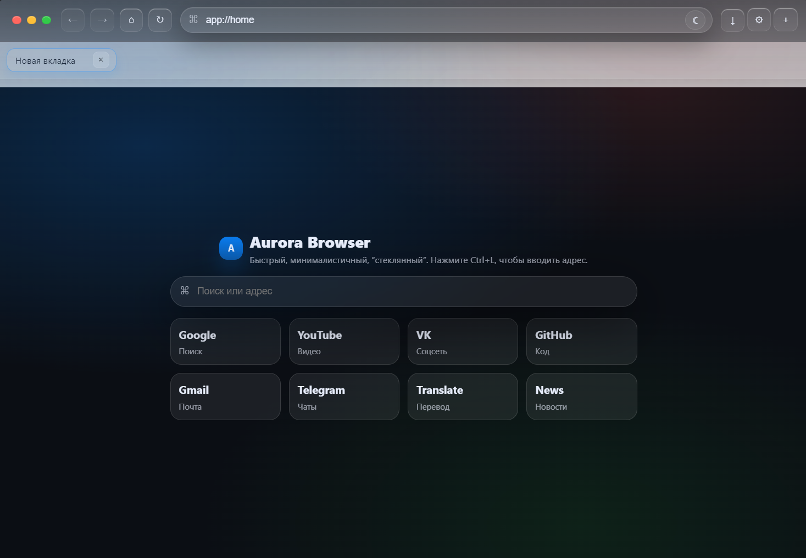

# Aurora Browser

Desktop browser built with Electron, featuring a beautiful macOS-inspired UI with dark theme support.

[English](./README.md) | [Русский](./README.ru.md)

## Features

- 🌙 **Dark Theme by Default** - Beautiful dark interface out of the box
- 🎨 **macOS Style UI** - Modern design with tabs, address bar, and navigation
- ⚡ **Fast & Lightweight** - Built on Electron for cross-platform compatibility
- 🔒 **Secure** - Sandboxed web views with standard browser security

## Screenshots



## Downloads

### Windows
- [Aurora Browser 1.0.0.exe](https://github.com/Allex863/aurora-browser/releases/latest) - Portable

## Installation

### Portable Version
1. Download `Aurora Browser 1.0.0.exe`
2. Run directly - no installation required

## Development

### Requirements
- Windows 10/11
- Node.js LTS

### Setup
```bash
git clone https://github.com/Allex863/aurora-browser.git
cd aurora-browser
npm install
npm start
```

### Keyboard Shortcuts
- `Ctrl+L` - Focus address bar
- `Ctrl+T` - New tab
- `Ctrl+W` - Close tab
- `Ctrl+R` - Refresh

### Build
```bash
npm run dist
```

## License

MIT License - feel free to use and modify!

---

Made with ❤️ by [Allex863](https://github.com/Allex863)
